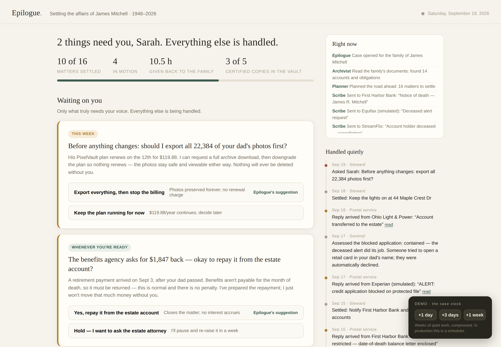
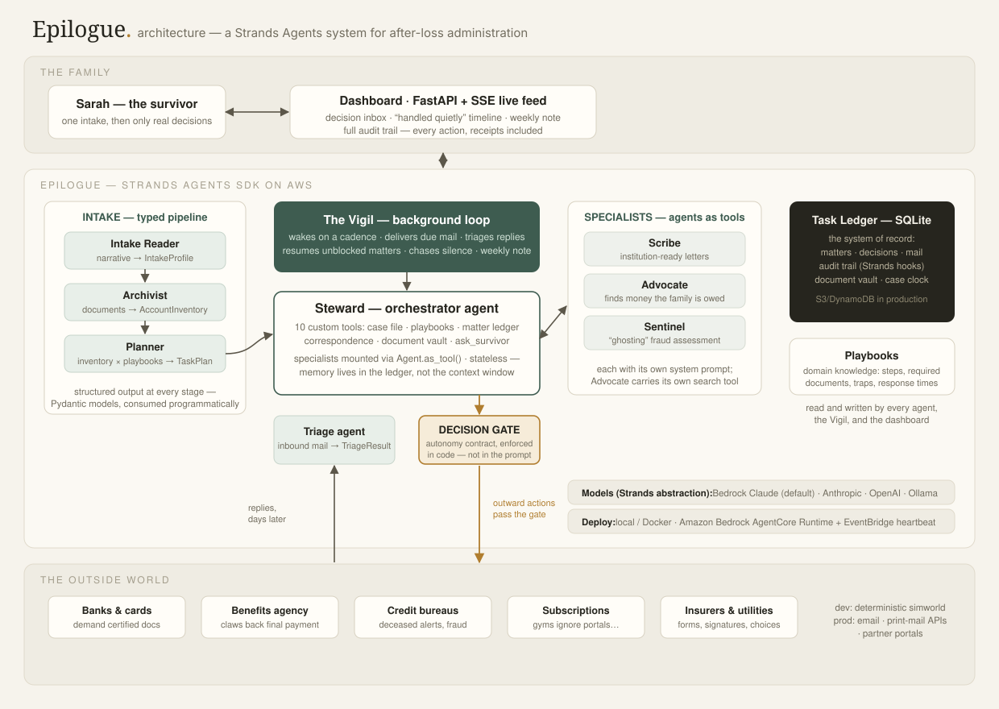

<div align="center">

# Epilogue<sup>·</sup>

### The agent that settles what's left behind.

*An autonomous after-loss administration agent, built on the [Strands Agents SDK](https://strandsagents.com) for the AWS **Agents for Humans** hackathon — Everyday Agents track.*

[](https://github.com/shi1720/epilogue/actions/workflows/ci.yml)
[](LICENSE)
[](pyproject.toml)
[](https://strandsagents.com)



</div>

---

## The problem nobody builds for

When someone dies, their family inherits a second, invisible job. Banks to notify — each demanding its own certified documents. Government benefits that must be *stopped*, and the final payment *returned*. A dozen subscriptions that keep billing a dead man's card. A gym that only accepts cancellation *by written letter*. Utilities at a house that must stay heated until it sells. A life-insurance claim buried in forms. And identity thieves, who specifically target the recently deceased in the weeks before credit bureaus find out — a crime so common it has a name: **ghosting**.

Empathy's *Cost of Dying* research puts the administrative burden of a death at **420–500 hours** of the family's time, spread over **12–18 months** — phone trees, forms, and follow-ups, carried by people at the worst moment of their lives. The British have a word for it: *sadmin*.

The hackathon brief asks for agents that take on life's repetitive tasks and "only surface when there's a real decision to make." We asked: **where in a human life is that pain at its absolute maximum?** This is our answer.

## What Epilogue does

You tell Epilogue what happened, in your own words, and paste in the shoebox — statements, mail, notes. Then it goes to work, and **stays** at work for months:

- **Reads everything** — the Archivist inventories every account, subscription, obligation, and asset your documents reveal, with cited evidence for each.
- **Plans the whole road** — the Planner turns that inventory into a complete matter plan using institutional playbooks that know the traps (joint accounts must *not* be closed; benefits paid for the month of death get clawed back; gyms ignore their own cancellation portals).
- **Does the work end to end** — the Steward drafts institution-ready letters (via the Scribe), submits them with the right documents attached, tracks every reply, and **chases silence**: when an institution stalls, it re-sends, switches channels, escalates.
- **Finds money you're owed** — the Advocate hunts unclaimed property, refundable prepayments, benefit entitlements. Settling an estate shouldn't only be about closing things.
- **Stands guard** — deceased alerts at all three credit bureaus on day one; the Sentinel assesses every fraud signal against the estate.
- **Bothers you almost never** — and *this is the product*. Routine work runs quietly. You get a decision card only when something is irreversible, sentimental, or moves real money — and a weekly note, in plain language, about everything handled while you were living your life.

## "Only real decisions" is an engineering feature, not a promise

Every agent demo says "human in the loop." Epilogue makes it a **contract, enforced in code**:

1. At intake, the survivor grants an **Autonomy Contract**: per-category autonomy levels (subscriptions: act freely · finances: act and show me · memories: always ask) plus a hard dollar threshold.
2. Every outward action passes a **Decision Gate** in plain Python — not in the prompt. An action that is irreversible, above threshold, or in an ask-first category is *refused* unless a resolved survivor decision is on file, and the refusal tells the model exactly how to proceed: surface a decision with `ask_survivor`, then stand down.
3. The system prompt teaches the Steward to be careful; the gate **makes** it careful. A confused model cannot touch an ask-first category or an irreversible matter without a resolved decision on file — and a money move above the threshold is only honored when a survivor decision **explicitly authorizes that amount** (`authorizes_amount_usd`), so approving "transfer the profiles" never quietly authorizes a payment. (Amounts are declared by the agent today; the production roadmap pairs the gate with structured payment rails so amounts are verified, not declared.)

Defense in depth like this is what it takes to hand an autonomous agent the affairs of someone's father.

## Architecture

<div align="center">

</div>

### The cast (all Strands `Agent`s)

| Agent | Role | Strands features it exercises |
|---|---|---|
| **Steward** | Orchestrator: owns the case, works matters end to end | 10 custom `@tool`s, specialists via `Agent.as_tool()`, hooks, sliding-window conversation manager |
| **Scribe** | Drafts institution-ready correspondence | agent-as-tool, per-case system prompt |
| **Advocate** | Finds money the family is owed | agent-as-tool with its own search tool |
| **Sentinel** | Assesses identity-theft signals ("ghosting") | agent-as-tool |
| **Intake Reader → Archivist → Planner** | Typed intake pipeline: narrative → `IntakeProfile`, documents → `AccountInventory`, inventory × playbooks → `TaskPlan` | structured output (Pydantic) at every stage |
| **Triage** | Classifies each inbound reply into a typed `TriageResult` so the Vigil can route it mechanically | structured output |

### Design decisions worth stealing

- **Agents are stateless between cycles.** All memory lives in the SQLite task ledger — matter notes, correspondence, decisions, the case clock. Any Steward instance can pick up any case at any time; the context window is a scratchpad, never the system of record. That's what makes the system restartable, horizontally scalable, and auditable.
- **The audit trail is a Strands hook.** A `HookProvider` subscribes to `BeforeToolCallEvent`/`AfterToolCallEvent` and writes every tool invocation to the ledger — feeding both the dashboard's live activity stream (SSE) and a permanent "everything Epilogue did" record. Trust needs receipts.
- **The world is deterministic; the agent is not.** Simulated institutions are scripted state machines (below), so every demo exercises the *agent's* judgment against honest, reproducible resistance.
- **Time is a first-class citizen.** Estate settlement runs on a slow clock. The Vigil wakes on a cadence, delivers due mail, chases overdue follow-ups, and compresses "two weeks later" into a button press for the demo — in production, the same tick runs from a scheduler (EventBridge → AgentCore).

## Quickstart

```bash
git clone https://github.com/shi1720/epilogue.git && cd epilogue
python -m venv .venv && source .venv/bin/activate
pip install -e .

# Pick a model provider (Bedrock is the default):
export AWS_REGION=us-east-1            # with Bedrock access to Claude Sonnet, or:
# export EPILOGUE_MODEL_PROVIDER=gemini   && pip install -e ".[gemini]"   && export GOOGLE_API_KEY=...   # FREE key: aistudio.google.com/apikey
# export EPILOGUE_MODEL_PROVIDER=anthropic && pip install -e ".[anthropic]" && export ANTHROPIC_API_KEY=...
# export EPILOGUE_MODEL_PROVIDER=openai   && pip install -e ".[openai]"   && export OPENAI_API_KEY=...
# export EPILOGUE_MODEL_PROVIDER=ollama   && pip install -e ".[ollama]"   # local, no key

epilogue demo        # fresh database, dashboard at http://127.0.0.1:8000
```

Then, in the browser:

1. **Use the demo case** → **Begin.** Watch the live feed as the Archivist reads the family's documents and the Planner lays out ~16 matters. Day one's letters go out on their own.
2. Advance the **case clock** (+3 days). Replies arrive: the bank wants certified documents (sent), StreamFlix offers to preserve Dad's profiles (that's a real choice — it comes to you), the gym… says nothing at all.
3. Keep advancing. Watch Epilogue chase the gym into a written letter, field a $1,847 clawback from the benefits agency (asks you — it's over your threshold), block a fraudulent credit application with the deceased alerts it placed on day one — the simulation is honest: had the alerts not been placed by day 9, the application is approved instead — and write you a weekly note about all of it.
4. Answer a decision card and watch the agent resume that matter within seconds.

No model credentials? The **UI preview** still works: `EPILOGUE_DATA_DIR=data-preview python scripts/preview_state.py && EPILOGUE_DATA_DIR=data-preview epilogue serve` (seeded state, no agent). The test suite (below) also runs fully offline.

## The simulated world — and why it's honest

Epilogue's agents talk to `simworld`: fifteen fictional institutions implemented as deterministic state machines that reproduce the real texture of this problem — multi-round document demands, silent non-replies, post-death charges, clawback notices, bereavement policies, fraud attempts. Replies are **not** LLM-generated: the world stays scripted and reproducible, so what you're evaluating is the *agent's* behavior, exactly the discipline you'd want in any autonomous-system evaluation.

In production, `simworld` swaps for real channels — secure email, print-and-mail APIs (e.g. Lob), institution portals, and the death-notification integrations that estate-tech companies already operate. The agent layer above does not change. One clean seam: [`SimWorld.submit(...)`](src/epilogue/simworld/world.py).

## Authority, review, and data — the honest version

An agent in this domain touches real authority and real PII, so the boundaries are explicit:

- **Authority.** Epilogue acts as a *preparer and correspondent* under the executor's direction — the legal actor is always the human personal representative, named on every letter. Wet-ink signatures, notarizations, and legal filings are never automated: they surface as prepared-for-you decisions. A per-letter **review mode** (every outbound letter waits for approval) is the planned default for cautious users; today the autonomy contract's `ask_first` level provides it per category. Epilogue prepares paperwork; it does not practice law.
- **Review.** Everything is inspectable after the fact: the audit trail records every tool call, every letter is stored verbatim, and decisions carry the context the agent had when it asked.
- **Data.** The demo stores only what you paste, locally in SQLite; the domain model deliberately holds masked identifiers (`ssn_last4`, `checking ...4417`), never full account or Social Security numbers. A production deployment moves the ledger to encrypted managed storage (S3/DynamoDB) with the same schema.

## Tests

```bash
pip install -e ".[dev]"
pytest            # 29 tests, fully offline, < 2s
```

The suite drives the **real Strands event loop** with a deterministic `ScriptedModel` (a `strands.models.Model` implementation that replays scripted tool calls and structured outputs). It covers the ledger, the simulated institutions, the Decision Gate (blocked → ask → approved → allowed), vault depletion of certified death certificates, and a full matter lifecycle: intake → plan → first contact → document demand → certified copy → settled.

## Deploying on Amazon Bedrock AgentCore

Epilogue's Vigil maps naturally onto AgentCore Runtime: each heartbeat is an invocation, EventBridge Scheduler replaces the local clock, and identity/memory/observability come from the platform.

```bash
pip install -e ".[agentcore]" bedrock-agentcore-starter-toolkit
agentcore configure --entrypoint deploy/agentcore/agentcore_app.py
agentcore launch
agentcore invoke '{"action": "open_case", "narrative": "...", "documents": "..."}'
agentcore invoke '{"action": "tick"}'    # wire this to EventBridge Scheduler, daily
```

See [`deploy/agentcore/agentcore_app.py`](deploy/agentcore/agentcore_app.py).

### Or: a public demo URL in ~10 minutes

[`docs/DEPLOY_FIREBASE.md`](docs/DEPLOY_FIREBASE.md) ships a one-command **Firebase Hosting → Cloud Run** deployment (`deploy/firebase/deploy.sh`): a clean `https://<project>.web.app` URL, the model key kept server-side as a Cloud Run env var, and an access-code gate so a shared link can't spend your credits. There's also a plain [`Dockerfile`](deploy/Dockerfile) for any container host.

## What it costs to run

Frugality is a design constraint: a grieving family should not pay for idle intelligence.

- The Vigil does **nothing** on a quiet day — no model calls at all. Mechanical routing (a reply that just says "done") is settled in code after one small Triage call.
- A working day runs the Steward once per active matter (capped per tick), with typed Triage calls at ~1K tokens each.
- A full case — intake, ~16 matters, ~8 weeks of correspondence — lands around **1–2M tokens ≈ $5–12 on Claude Sonnet via Bedrock**. Against 400+ hours of a family's time, the economics simply work — for the family, and for whoever provides Epilogue as a benefit.

## The business case — validated twice over

- **Market**: ~3.4M deaths/year in the US alone; each one creates this workload for a family. Empathy ($90M raised) and Settld (UK) sell adjacent human-powered/concierge services — validation that families and institutions pay for this. Epilogue's agentic core drives the marginal cost of a case toward the price of tokens.
- **Model**: B2B2C — distributed through life insurers, employers (bereavement benefits), banks, and funeral homes, who already pay for exactly this as a retention and care benefit. Estates also pay directly: settling one is a fiduciary duty with a budget.
- **Moat**: the playbook library (institution-by-institution procedural knowledge), the Autonomy Contract trust layer, and an auditable ledger designed for fiduciary review.
- **Beyond death**: the same architecture — inventory, playbooks, quiet persistence, decision gate — fits every "paperwork avalanche" life transition: divorce, a dementia diagnosis, immigration, a house move.

## Repository layout

```
src/epilogue/
  domain.py        # Pydantic domain model (cases, matters, decisions, typed agent outputs)
  ledger.py        # SQLite system of record + audit trail + event bus + case clock
  playbooks.py     # institutional domain knowledge the Planner and Steward consult
  runtime.py       # per-case runtime + the Decision Gate (code-enforced autonomy)
  tools.py         # the Steward's 10 custom Strands tools
  agents.py        # Steward, Scribe, Advocate, Sentinel, Triage + typed intake pipeline
  audit.py         # Strands HookProvider → audit trail
  engine.py        # the Vigil: background work cycles on the case clock
  server.py        # FastAPI dashboard + JSON API + SSE live feed
  simworld/        # deterministic simulated institutions
web/               # the survivor's dashboard (no build step)
tests/             # offline suite incl. ScriptedModel Strands-loop tests
deploy/agentcore/  # Amazon Bedrock AgentCore entrypoint
docs/              # architecture, demo script, submission materials
```

## License

[MIT](LICENSE) — built by **Shivam Gupta** for the AWS *Agents for Humans* hackathon, 2026.

*The demo case — James Mitchell, his daughter Sarah, and every institution in `simworld` — is fictional.*
